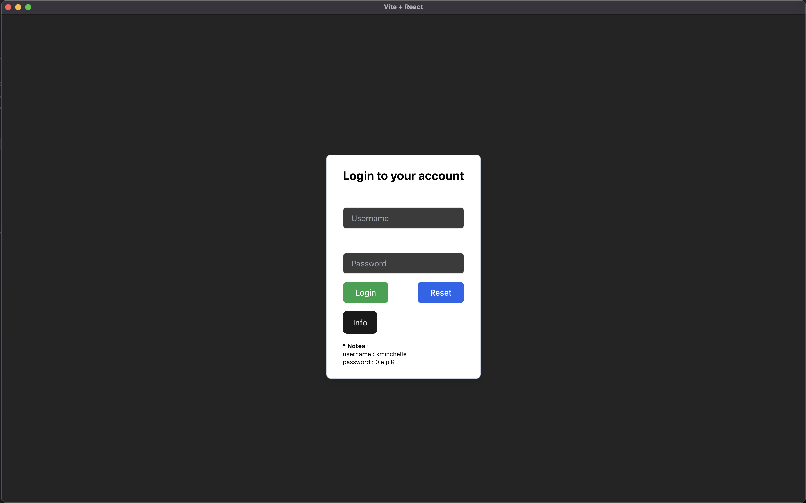
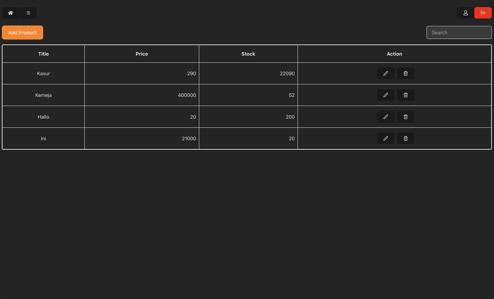
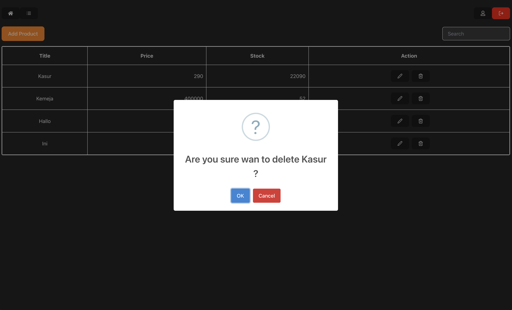
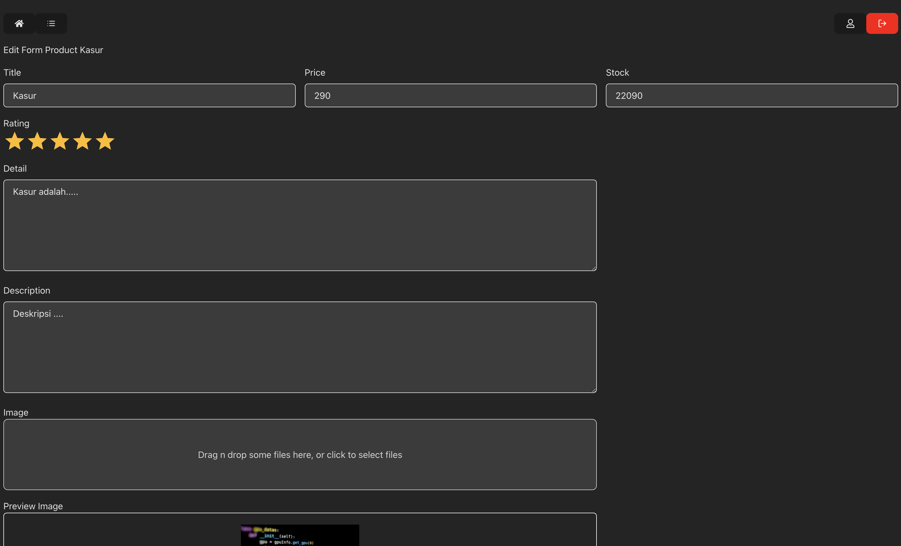
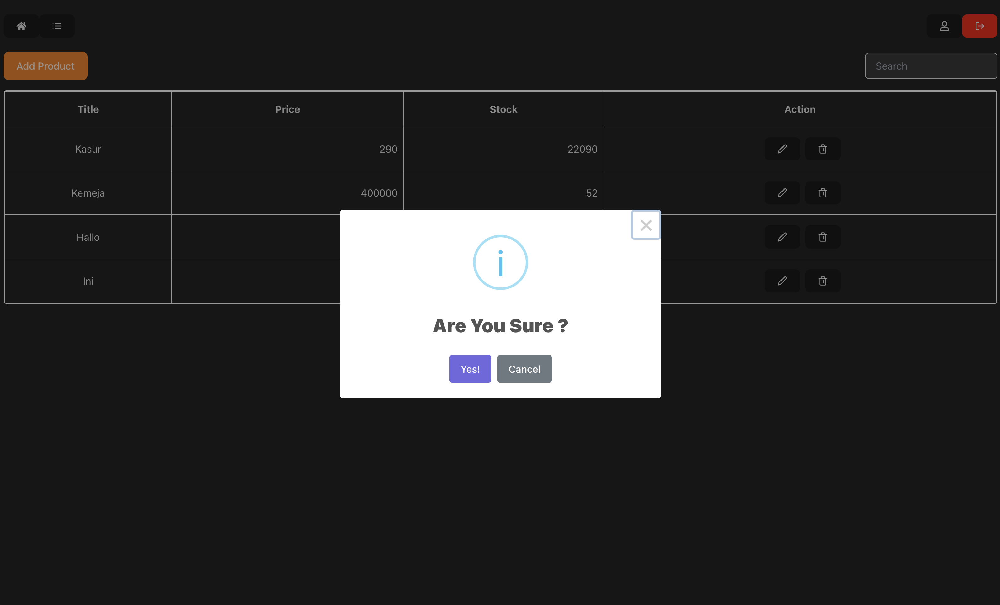

# Electron With Reactjs

## Spesification

## Requirements
1. nvm versi 0.39.1
2. npm (v20.11.0 / lts/iron saya menggunakan nvm)
3. electron versi 28.2.3
4. react menggunakan react vite (react versi 18)

## Struktur Folder :
1. folder electron = test-dss-electron (dengan repo : https://github.com/yogiesetiarko/test-dss-reactjs.git)
2. folder reactjs = test-dss-reactjs (dengan repo : https://github.com/yogiesetiarko/test-dss-electron.git)
3. buatlah satu buah folder baru untuk meletakkan kedua folder project diatas, nama folder boleh apapun itu (ex: aplikasilucu)
4. lakukan git clone kedua repository tersebut secara satu per satu
4. sehingga struktur folder akan menjadi seperti ini :
	- project electron = aplikasilucu/test-dss-electron
	- project reactjs = aplikasilucu/test-dss-reactjs
5. lakukan npm install pada masing masing folder (demi kelancaran project, jangan lupa dengan spesifikasi npm version nya)

## Installing (Integration)
### Run Development
1. setelah clone folder react lakukan npm install dahulu,
2. jika sudah maka npm run dev pada folder reactjs
3. jika react sudah berjalan, maka beralihlah ke folder electron,
4. jalankan npm install di dalam folder electron
4. jalankan npm run live pada electron
5. jika sudah tunggu dahulu hingga window keluar, dan development sudah bisa dilakukan
6. sudah dilengkapi dengan hotreload jika terjadi perubahan pada reactjs

### Run Production (Build)
1. npm run build pada reactjs 
2. maka akan muncul folder app di dalam project electron
3. npm run electron:build dan tunggu proses build hingga selesai
4. npm run electron:build => ini akan menghasilkan folder release, jika di laptop saya macbook pro akan menghasilkan file installer dmg di dalam folder release,
dan juga menghasilkan file yang bernama "test-dss-electron" di dalam /Users/yogiedigital/Downloads/dss/test-dss-electron/release/1.0.0/mac/test-dss-electron,
ini adalah portable file yang bisa digunakan

## Technical helper
- [Electron official](https://www.electronjs.org/docs/latest/tutorial/quick-start)
- [Vite official](https://vitejs.dev/guide/)
- [Nodejs docs](https://nodejs.org/docs/latest/api/)
- [official nodejs SDK for atlas](https://www.mongodb.com/docs/realm/sdk/node/quick-start/)

## Images

